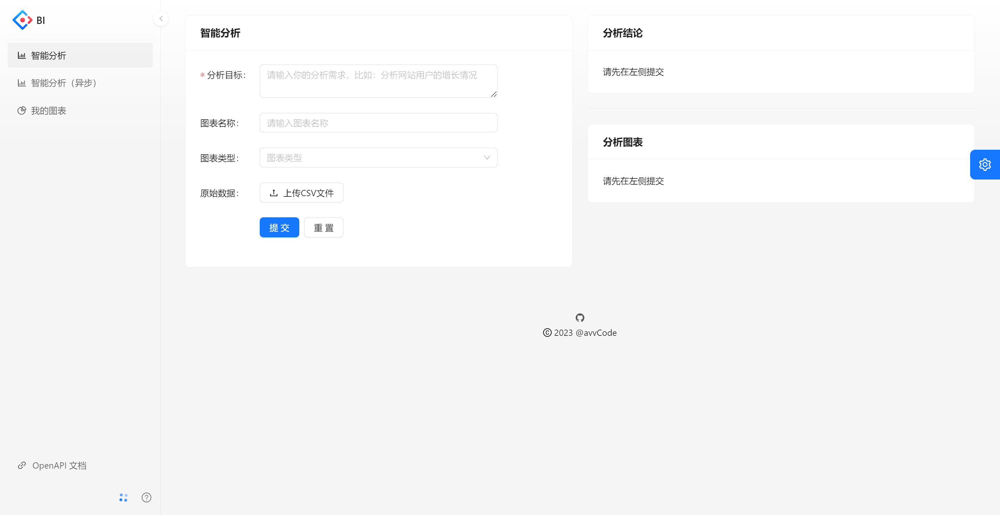
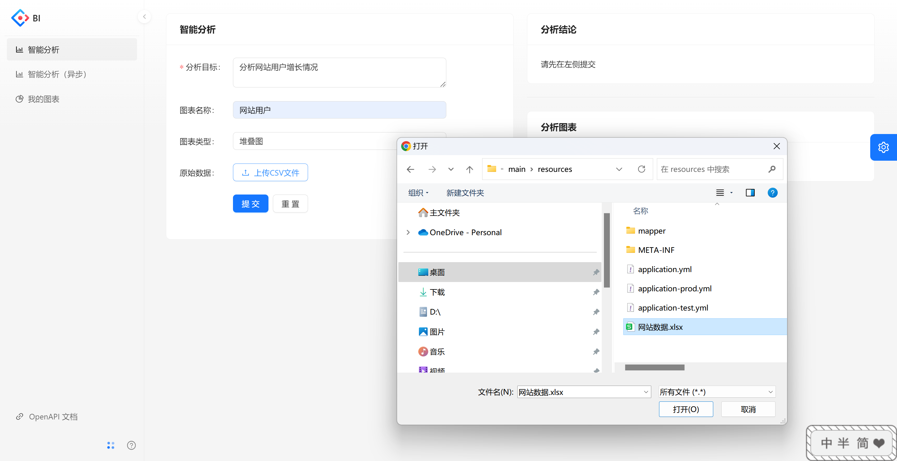
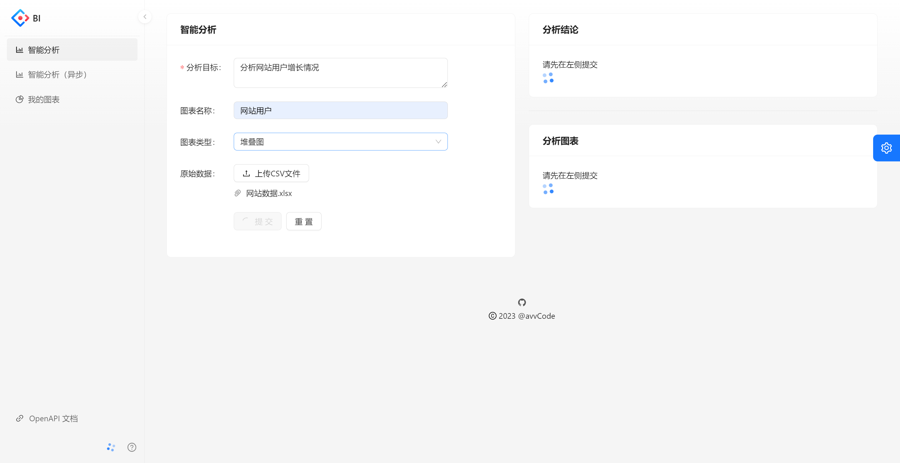
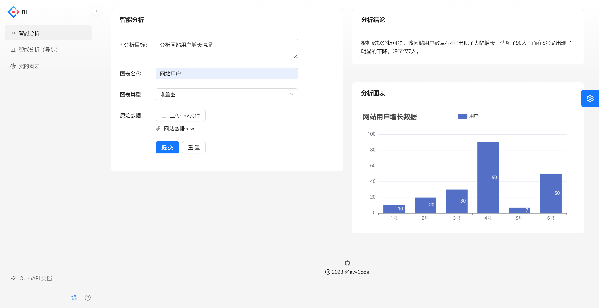
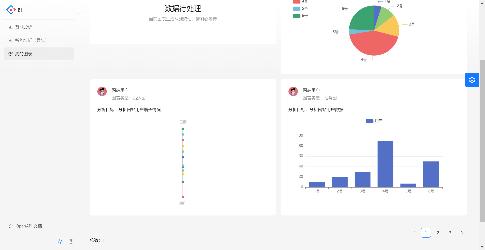
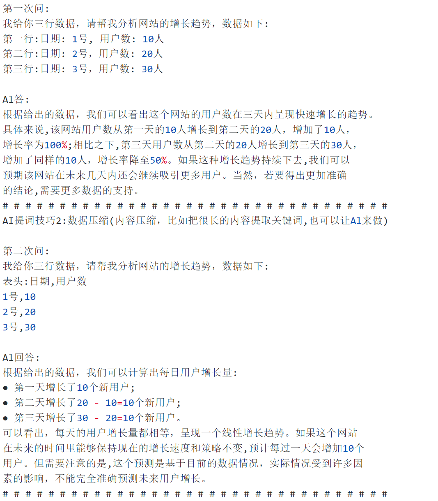
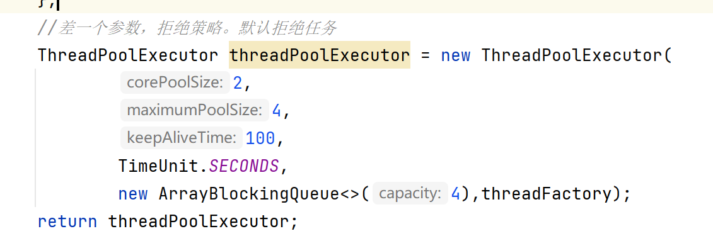
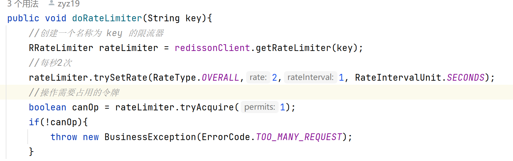
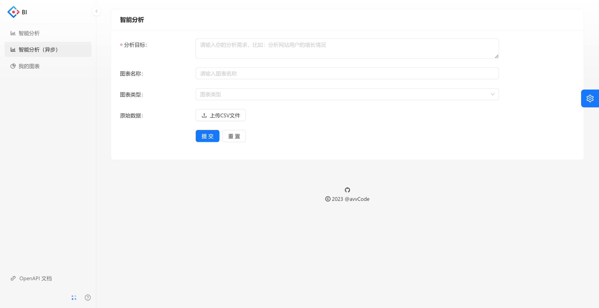
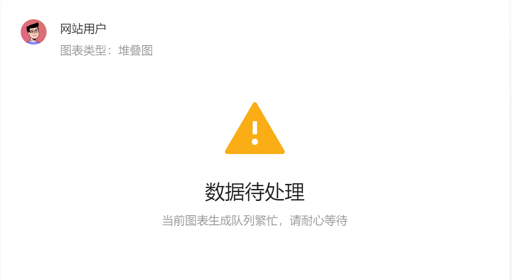

## Easy-Data-Analyze
基于 Spring Boot + MQ + AIGC 的智能数据分析平台。用户只需要导入原始数据集、
并输入分析诉求，就能自动生成可视化图表及分析结论，降低数据分析的人工成本、提高数据分析效
率

### 页面展示
#### 在智能分析页面


#### 点击上传数据 和 分析诉求



#### 等待生成



#### 生成成功



#### 在我的图表查看历史分析



### 接口设计概述

### 数据压缩
对于一般的AI接口，都会对用户的输入做限制。对一些无用的话进行压缩


其实第一次与第二次提问，给出的回答都是一样的。

#### 后端自定义 Prompt 预设模板并封装用户输入的数据和分析诉求
要求AI返回数据格式如下
```json
你是一个数据分析师和前端开发专家，接下来我会按照以下固定格式给你提供内容：
分析需求:
{数据分析的需求或者目标}
原始数据:
{csv格式的原始数据，用,作为分隔符}
请根据这两部分内容，按照以下指定格式生成内容(此外不要输出任何多余的开头、结尾、注释)
【【【【【
{前端 Echarts V5 的 option 配置对象json代码，合理地将数据进行可视化，不要生成任何多余的内容，比如注释}
【【【【【
{明确的数据分析结论、越详细越好，不要生成多余的注释}
```
测试AI返回的数据如下
```json
user: 分析需求：
分析网站用户的增长情况
原始数据:
日期,用户数
1号,10
2号,20
3号,30
assistant: 【【【【【
{
  "title": {
    "text": "网站用户增长数据",
    "subtext": ""
  },
  "tooltip": {
    "trigger": "axis"
  },
  "xAxis": {
    "type": "category",
    "data": ["1号", "2号", "3号"]
  },
  "yAxis": {
    "type": "value"
  },
  "series": [
    {
      "name": "用户",
      "type": "line",
      "data": [10, 20, 30]
    }
  ]
}
【【【【【
根据数据分析可得，该网站用户数量逐日增长，时间越长，用户数量增长越多
```


#### 对AI响应时长以及限制并发数做优化

##### 解决方案一

利用线程池优化任务数量
最大限制5个任务同时进行


##### 解决方案二
线程池任务队列只能在单体项目并且重启之后任务丢失

引入分布式消息队列RabbitMQ


消息消费失败后，用户依旧可以看到结果，而不是直接丢失数据

#### 对接口进保护
利用Redisson的RateLimit对图表生成做限流



#### 优化，异步化图表生成 + 状态机



生成成功后直接返回用户数据，而不是一直阻塞等待。
过了一段时间后，用户可直接去 我的图表 中查看数据。


